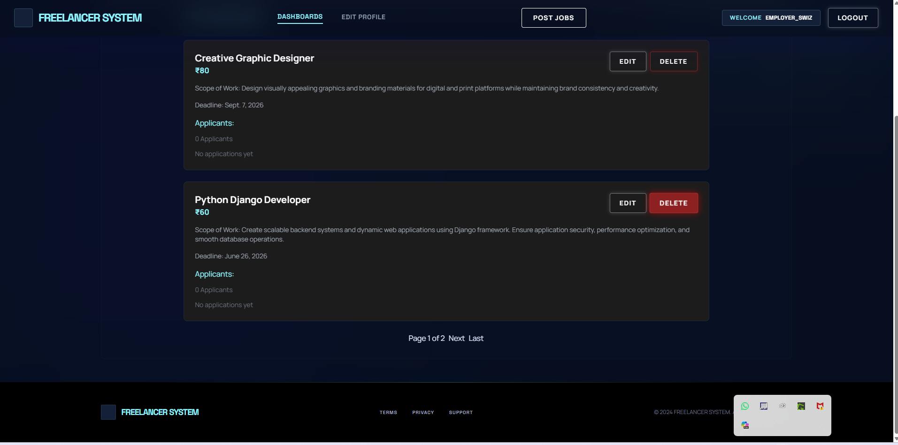
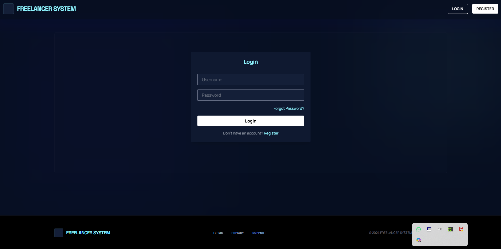
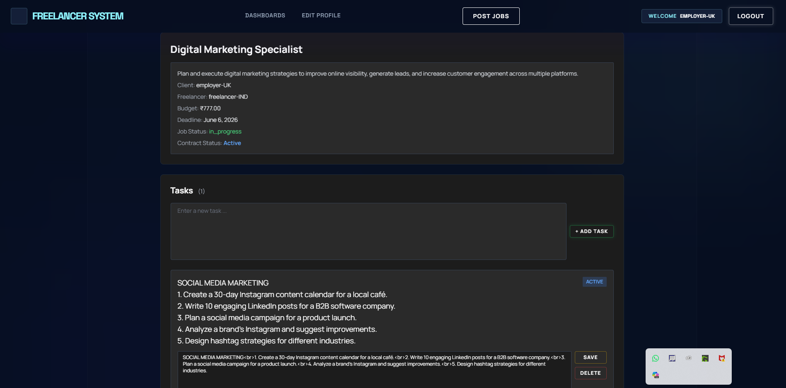

# 🚀 Freelancer System

A full-stack freelance marketplace platform built using **Django**, where employers can post jobs and freelancers can apply, manage contracts, and receive payments securely.

This project demonstrates real-world backend development concepts including authentication, role-based access control, contract workflows, and payment integration.

---

## ✨ Features

- 🔐 User Authentication (Login/Register)
- 👨‍💼 Separate Dashboards for Freelancers & Employers
- 💼 Job Posting & Management
- 📄 Job Application System
- 🤝 Contract Management
- 💳 Razorpay Payment Integration
- 👤 Profile Management
- 📁 Media/File Upload Support
- 📱 Responsive UI Design

---

## 🛠️ Tech Stack

| Technology | Purpose |
|------------|---------|
| Python | Backend Language |
| Django | Web Framework |
| SQLite | Database |
| HTML/CSS/JavaScript | Frontend |
| Tailwind CSS | UI Styling |
| Razorpay API | Payment Gateway |

---

## 📂 Project Structure

```bash
freelancer_system/
│
├── jobs/               # Job, application & contract logic
├── profiles/           # User profile management
├── templates/          # Frontend templates
├── media/              # Uploaded media files
├── screenshots/        # Project screenshots
├── manage.py
└── README.md
```

---

## ⚙️ How to Run Locally

### 1️⃣ Clone Repository

```bash
git clone https://github.com/your-username/freelancer_system.git
cd freelancer_system
```

### 2️⃣ Install Dependencies

```bash
pip install -r requirements.txt
```

### 3️⃣ Apply Migrations

```bash
python manage.py migrate
```

### 4️⃣ Run Development Server

```bash
python manage.py runserver
```

Server will start at:

```bash
http://127.0.0.1:8000/
```

---

## 📸 Screenshots

### 🏠 Employer Dashboard


---

### 👨‍💻 Freelancer Dashboard


---

### 🔐 Login Page


---

### 📄 Contract Page


---


## ⭐ Project Purpose

This project was built to demonstrate:

- Full-stack Django development
- Scalable project architecture
- Authentication & authorization systems
- Payment workflow integration
- Real-world freelancer marketplace functionality
